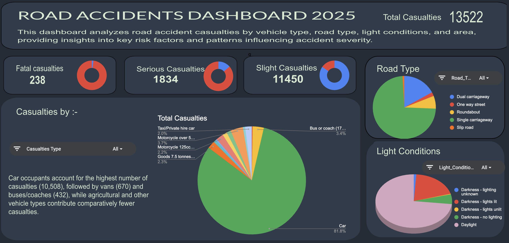

# 🚧 Road Accident Analytics – Infrastructure Stability Dashboard (UK)

A data analytics capstone project focused on **UK road accident data (2021–2022)**, aimed at understanding where casualties concentrate, which road environments are most dangerous, and how risk varies across geography, road type, lighting, and seasonal conditions.

---

## 📌 Project Overview

This project analyzes **10,000 UK road accident records** to identify **structural and predictable risk patterns** affecting public road safety. Using spreadsheet-based analytics and an interactive dashboard, raw accident data is converted into actionable insights for infrastructure planning and safety decision-making.

The analysis focuses on answering questions such as:

- Which **road types** contribute the most to casualties?  
- How does **rural vs. urban** risk differ per incident?  
- What **seasonal patterns** exist in accident severity?  
- How do **lighting and surface conditions** influence outcomes?  

A final **interactive dashboard** allows stakeholders to explore these patterns dynamically without technical expertise.

---

## 📜 Data Dictionary (Quick View)

**Source:** UK Road Accident Dataset (Kaggle)  
**Time Period:** 2021–2022  
**Records Used:** ~9,953 (after cleaning)  
**Total Columns:** 23  

Key fields used in analysis:

| Column | Description | Data Type |
| :-- | :-- | :-- |
| `Accident_Severity` | Fatal / Serious / Slight | Categorical |
| `Road_Type` | Single Carriageway, Dual, Roundabout, etc. | Categorical |
| `Urban_or_Rural_Area` | Urban or Rural classification | Categorical |
| `Number_of_Casualties` | Casualties per accident | Integer |
| `Light_Conditions` | Daylight / Dark / No Lighting | Categorical |
| `Road_Surface_Conditions` | Dry / Wet / Snow / Frost | Categorical |
| `Speed_Limit` | Posted speed limit | Integer |
| `Weather_Conditions` | Weather at time of incident | Categorical |
| `Vehicle_Type` | Type of vehicles involved | Categorical |
| `Date` | Accident date (used for month/year analysis) | Date |

---

## 🧹 Data Cleaning Notes

All cleaning and preparation were performed using **Google Sheets**, following capstone constraints.

Key steps included:

- Removed duplicate accident records using a composite key  
  *(Date + Location + Severity)* → **47 duplicates removed**
- Filled missing categorical values with `"Unknown"` to retain records
- Standardized date formats and extracted **Month** and **Year**
- Cleaned inconsistent categorical labels across road type and lighting
- Engineered derived fields:
  - `Severity_Intensity` (Critical / High / Moderate)
  - `Rural_Risk_Flag` for geographic filtering
- Reviewed extreme casualty values and retained valid multi-vehicle incidents

After cleaning, **9,953 high-quality records** were used for analysis.

---

## 💡 Key Insights

From the cleaned dataset and dashboard analysis:

- **Single Carriageways account for ~73% of all casualties**, indicating a strong infrastructure-related risk.
- **Rural accidents are 1.16× more severe per incident** compared to urban areas.
- **October and November are peak risk months**, driven by reduced daylight and seasonal traffic patterns.
- **66.7% of accidents occur on dry roads**, challenging the assumption that weather is the primary risk factor.
- **Fatal and Serious accidents (~15%) are concentrated and predictable**, mostly on rural single carriageways under low-light conditions.
- **2022 shows a modest (~3%) reduction** in total casualties compared to 2021, suggesting partial but insufficient improvement.

---

## 📊 Dashboard Summaries

The final dashboard was built using **Pivot Tables, charts, and interactive slicers** to support executive-level exploration.

The dashboard includes:

- KPI tiles showing **Total Casualties, Fatal Incidents, and Rural Risk Multiplier**
- Casualty distribution by **road type** and **severity**
- Monthly and seasonal trend analysis
- Rural vs. Urban comparative views
- Road surface and lighting condition breakdowns

All visuals update dynamically based on slicer selections (Year, Severity, Road Type, Geography), enabling fast insight generation and targeted risk assessment.

---

## 🙌 Acknowledgements

- Faculty Mentors: Archit Raj and Satyaki Das for guidance on the DVA capstone.  
- Team Members (Group-11): Aadit, Krish Garg,Manya Verma, Abuzar Haideri, Tathagat Harsh & Tanish Rao – for sourcing, cleaning, analysis, dashboarding, and documentation.
- Data Source: UK Road Accident Dataset (Kaggle)  

---

## 🧾 Conclusion

This project demonstrates how structured data analytics and dashboarding can reveal **non-random, systemic road safety risks**. By identifying where and when accidents concentrate, the dashboard provides a reusable analytical framework for monitoring infrastructure stability and guiding targeted safety interventions.

The findings reinforce that **data-driven, location- and season-specific actions** can significantly improve public safety outcomes.